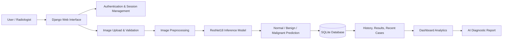

# LungGuard AI

<div align="center">
  
  <h3>AI-powered lung cancer detection for clinical decision support</h3>
</div>

<p align="center">
  
  
  
  
</p>

LungGuard is a secure web application built with Django for AI-assisted lung cancer screening from chest X-ray images. It uses a trained ResNet18 deep learning model to classify scans into Normal, Benign, or Malignant categories and presents the result with a confidence score to support radiologist review.

## Overview

This project is designed for clinical environments where fast and reliable image analysis can help medical professionals detect early signs of lung cancer. Users can upload chest X-ray images, preprocess them, run inference with the trained model, and review predictions through a streamlined dashboard.

The platform includes:

- Secure authentication and user account management
- Chest X-ray upload and validation
- AI prediction using a trained ResNet18 model
- Classification into Normal, Benign, and Malignant
- Result history with searchable case tracking
- Dashboard analytics for prediction summaries
- Clinical workflow support with radiologist-friendly reporting

## Key Features

- Deep learning-based lung cancer detection from X-ray images
- Real-time classification with confidence scoring
- User-specific prediction history and case tracking
- Dashboard with summary statistics and recent analyses
- Medical interface for upload, result, and profile flows
- Model file integration from the local project repository
- Built with Django and PyTorch for scalable web deployment

## Model and Dataset

The project uses a ResNet18 model trained on the IQ-OTH/NCCD lung cancer dataset.

- Model file: `models/resnet18.pth`
- Output classes: Normal, Benign, Malignant
- Architecture: ResNet18 (CNN)
- Framework: PyTorch

This model is intended for decision support and should always be reviewed by a medical professional before final diagnosis.

## System Architecture



## Tech Stack

- Python
- Django 4.2
- PyTorch
- TorchVision
- OpenCV
- Pillow
- NumPy
- SQLite
- HTML, CSS, JavaScript

## Screenshots

### Dashboard and Core Views

<div align="center">
  <table>
    <tr>
      <td align="center">
        <br />
        <b>Dashboard</b>
      </td>
      <td align="center">
        <br />
        <b>Home</b>
      </td>
      <td align="center">
        <br />
        <b>Landing View</b>
      </td>
    </tr>
  </table>
</div>

### Authentication and User Management

<div align="center">
  <table>
    <tr>
      <td align="center">
        <br />
        <b>Login</b>
      </td>
      <td align="center">
        <br />
        <b>Create Account</b>
      </td>
      <td align="center">
        <br />
        <b>Change Password</b>
      </td>
    </tr>
  </table>
</div>

### Analysis Workflow

<div align="center">
  <table>
    <tr>
      <td align="center">
        <br />
        <b>New Analysis</b>
      </td>
      <td align="center">
        <br />
        <b>Prediction Result</b>
      </td>
      <td align="center">
        <br />
        <b>Detailed Result</b>
      </td>
    </tr>
  </table>
</div>

### History, Profile, and Model Details

<div align="center">
  <table>
    <tr>
      <td align="center">
        <br />
        <b>History</b>
      </td>
      <td align="center">
        <br />
        <b>Profile</b>
      </td>
      <td align="center">
        <br />
        <b>Model Details</b>
      </td>
    </tr>
    <tr>
      <td align="center">
        <br />
        <b>Model Overview</b>
      </td>
      <td align="center">
        <br />
        <b>Recent Cases</b>
      </td>
      <td align="center">
        <br />
        <b>About</b>
      </td>
    </tr>
  </table>
</div>

## Project Workflow

1. User signs in or creates an account.
2. A chest X-ray image is uploaded through the dashboard.
3. The system validates and preprocesses the image.
4. The model predicts one of three classes: Normal, Benign, or Malignant.
5. Prediction details and confidence scores are saved to the database.
6. The result is displayed and stored in the history for later review.

## Installation and Setup

### 1) Clone the project

```bash
git clone <repository-url>
cd LUNGGUARD_AI
```

### 2) Create a virtual environment

```bash
python -m venv .venv
```

On Windows:

```powershell
.\.venv\Scripts\Activate.ps1
```

On macOS/Linux:

```bash
source .venv/bin/activate
```

### 3) Install dependencies

```bash
pip install -r requirements.txt
```

### 4) Apply database migrations

```bash
python manage.py migrate
```

### 5) Start the application

```bash
python manage.py runserver
```

Open the app in your browser:

```text
http://127.0.0.1:8000/
```

## Project Structure

```text
LUNGGUARD_AI/
├── detector/
│   ├── admin.py
│   ├── api_urls.py
│   ├── api_views.py
│   ├── auth_views.py
│   ├── config.py
│   ├── model_utils.py
│   ├── models.py
│   ├── preprocess.py
│   ├── serializers.py
│   ├── urls.py
│   └── views.py
├── lungguard/
│   ├── settings.py
│   ├── urls.py
│   ├── wsgi.py
│   └── asgi.py
├── models/
│   └── resnet18.pth
├── static/
├── templates/
├── uploads/
├── db.sqlite3
├── manage.py
├── requirements.txt
├── README.md
└── report data/
```

## References

1. IQ-OTH/NCCD Lung Cancer Dataset: https://www.kaggle.com/datasets/adityamahimkar/iqothnccd-lung-cancer-dataset
2. Django Documentation: https://docs.djangoproject.com/
3. PyTorch Documentation: https://pytorch.org/docs/
4. TensorFlow/PyTorch Documentation
5. World Health Organization - Cancer Fact Sheets
6. OWASP Web Security Guidelines
7. UML 2.5 Specification, Object Management Group (OMG)

## Conclusion

LungGuard demonstrates how modern deep learning and web technologies can be combined to support early lung cancer detection in a safe, user-friendly, and clinically meaningful workflow. It offers a strong foundation for medical imaging research, clinical decision support, and future expansion into broader diagnostic systems.

> This system is intended to assist medical professionals and should not replace professional clinical judgment.
